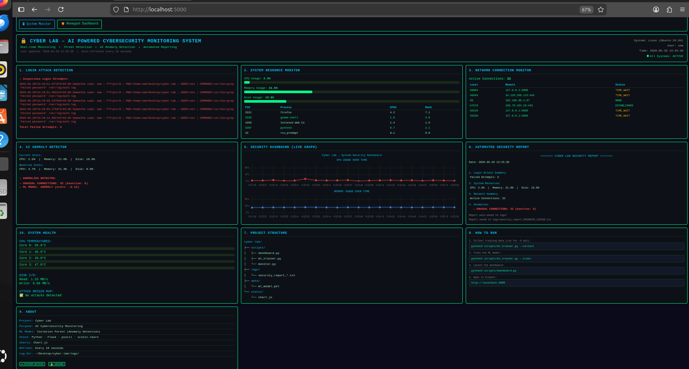
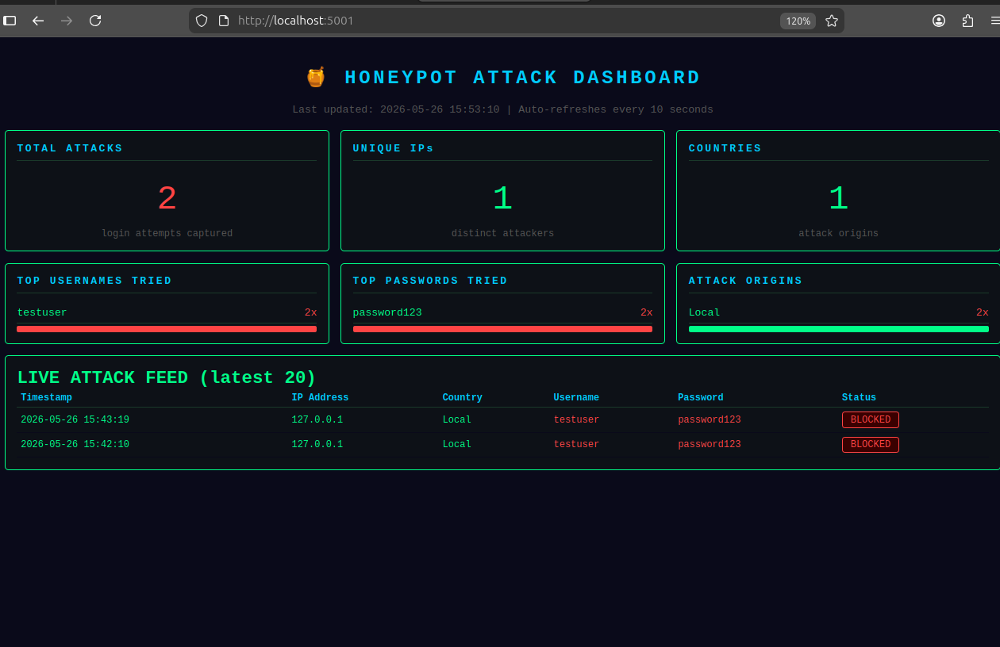
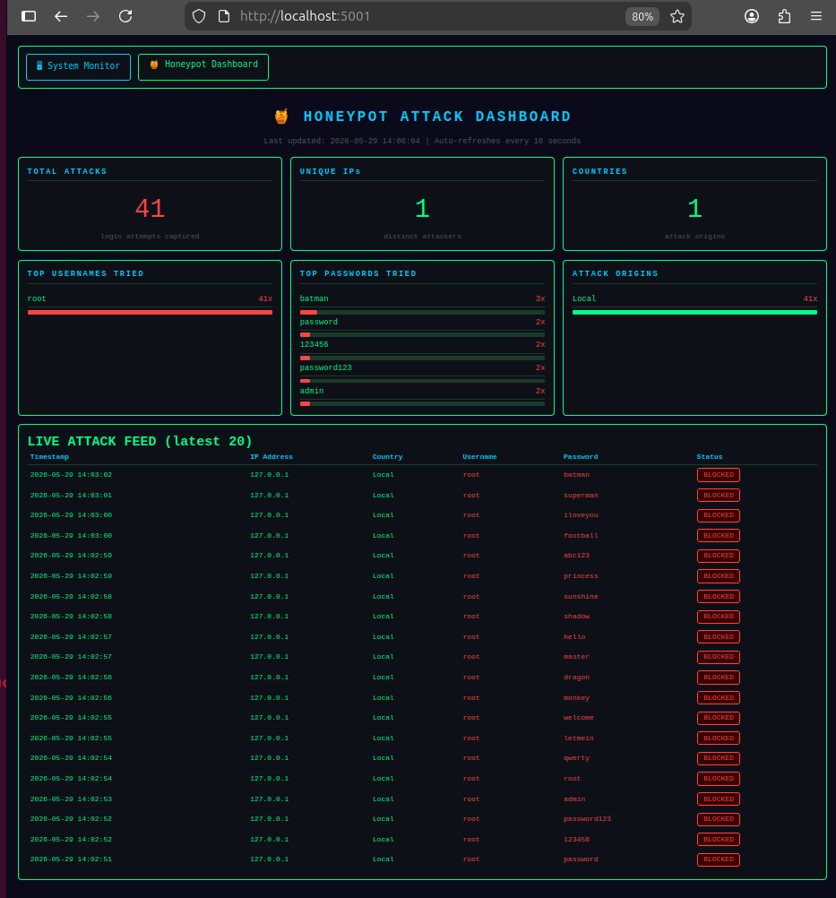

# 🔐 AI-Powered Cybersecurity Monitoring Lab


A real-time cybersecurity monitoring system built on Linux (Ubuntu) using Python.
This project combines cybersecurity, cloud computing, data engineering, Linux,
and AI to monitor system activity and detect suspicious behavior.

## 🛠️ Tools & Technologies
- Python 3.12
- psutil, Flask, matplotlib
- Linux (Ubuntu 24)
- Git & GitHub

## 📁 Project Structure
- scripts/ - All monitoring scripts
- logs/ - Auto-generated security reports
- dashboards/ - Charts and screenshots
- data/ - Baseline data
- ai_models/ - AI detection models

## 🚀 How to Run
Clone the repo and install dependencies, then run any script in the scripts/ folder.

## 📊 Features
- Login attack detection
- CPU, memory and disk monitoring
- Network connection tracking
- AI anomaly detection
- Automated security reports
- Live web dashboard

## 📸 Dashboard Preview


## 📸 Dashboard Preview


## 📸 Screenshots

### 🖥 Main System Monitor


### 🍯 Honeypot Attack Dashboard


### 🔴 Live Attack Capture (41 attacks)

## 👩‍💻 Author
**Samantha** | Cloud Computing & Information Security Student  
Data Engineering Student | Linux & AI Enthusiast  
Nairobi, Kenya 🇰🇪
## 🍯 Honeypot + Attack Visualizer

A fake SSH server that captures real brute-force attack attempts and visualizes them on a live dashboard.

### Features
- Fake SSH server on port 2222 using Paramiko
- Captures attacker IP, country, username & password
- Logs all attempts to JSON format
- Live attack dashboard at `http://localhost:5001`
- Auto-refreshes every 10 seconds

### How to Run

```bash
# Terminal 1 — start the honeypot
sudo python3 scripts/honeypot.py

# Terminal 2 — start the attack dashboard
python3 scripts/honeypot_dashboard.py
```

### Dashboard Preview

### Live Attack Capture

