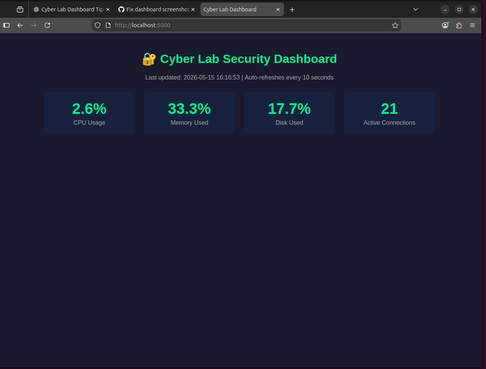

# 🔐 AI-Powered Cybersecurity Monitoring Lab

A real-time cybersecurity monitoring system built on Linux (Ubuntu) using Python.
This project combines cybersecurity, cloud computing, data engineering, Linux,
and AI concepts to monitor system activity, detect suspicious behavior,
and generate automated security reports.

---

## 🛠️ Tools & Technologies
- Python 3.12
- psutil (system & network monitoring)
- Linux (Ubuntu 24)
- Git & GitHub

---

## 📁 Project Structure

cyber-security-lab/
│
├── scripts/
│   ├── system_monitor.py
│   ├── network_monitor.py
│   └── security_report.py
│
├── logs/
│   └── security_report_*.txt
│
└── README.md

---

## 🚀 How to Run

```bash
# Clone the repo
git clone https://github.com/Samvee254/cyber-security-lab.git
cd cyber-security-lab

# Install dependencies
pip3 install psutil --break-system-packages

# Run full security report
python3 scripts/security_report.py

'''## Dashboard Preview

![Security Dashboard] (dashboards/dashboard_screenshot.png)


## 📸 Dashboard Preview


